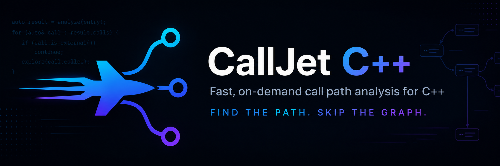

<div align="center">
  
</div>

# CallJet C++

> **Find the path. Skip the whole graph.**  
> Fast, on-demand static call path analysis for C and C++ without building the entire semantic call graph upfront.

[](LICENSE)
[](https://www.rust-lang.org/)

[English](README.md) | [한국어 (Korean)](README.ko.md)

---

## 📌 Core Principle

Traditional static analysis tools parse the entire codebase with a compiler front-end (such as Clang), often taking minutes to tens of minutes just to answer a focused question. CallJet solves this with a **three-step demand-driven pipeline**:

1. **Text Prefilter**: Searches for the requested symbol spelling and extracts only files that can contain a relevant declaration or call.
2. **Lazy Tree-sitter Discovery**: Parses only those matched files, then reuses their candidate symbols and call sites as traversal expands. It does not build a project-wide AST index at startup.
3. **Optional Clang Semantic Strengthening**: Uses `libclang` to upgrade candidates only in compilation contexts connected to the active query. If the database, context, or `libclang` is unavailable, CallJet keeps complete Tree-sitter candidates as `[POSSIBLE]`; it neither fails the query nor scans every entry in `compile_commands.json`.

---

## 🛠 Prerequisites

* **Rust**: `1.80` or newer (with Cargo)
* **LLVM / Clang (optional)**: `libclang` (v16+ recommended) enables `[CONFIRMED]` semantic results
  * **Windows**: `winget install LLVM.LLVM` or download from [LLVM Releases](https://github.com/llvm/llvm-project/releases)
  * **Linux (Ubuntu/Debian)**: `sudo apt-get install libclang-dev clang`
  * **macOS**: `brew install llvm`
* **Compilation Database (optional, recommended)**: `compile_commands.json` supplies build context for Clang verification
  * When using CMake: `cmake -B build -DCMAKE_EXPORT_COMPILE_COMMANDS=ON`
  * If it is missing or invalid, CallJet continues with Tree-sitter candidates. Use `-v` to see the recoverable diagnostic.

---

## 🚀 Build & Installation

```bash
# Clone repository and navigate to cpp directory
cd cpp

# Build optimized release binary
cargo build --release

# The executable will be at: target/release/calljet (or target/release/calljet.exe on Windows)
```

---

## 💻 CLI Usage Guide

For the common case, pass one method to `trace`. The lower-level commands remain available for directional and two-endpoint queries.

### 1. `trace` — One-method Call Path
Finds candidate paths from discovered top-level callers to one target method and upgrades edges when Clang verification is available.

```bash
calljet trace <METHOD> [OPTIONS]

# Example: Show how execution reaches Controller::dispatch
calljet trace "Controller::dispatch" --root . --compile-commands build/compile_commands.json
```

---

### 2. `callers` — Reverse Caller Traversal
Finds all callers that lead to a specific target function/symbol on demand.

```bash
calljet callers <TARGET_SYMBOL> [OPTIONS]

# Example: Find all callers of LeafFunction
calljet callers LeafFunction --root . --compile-commands build/compile_commands.json

# Example: Limit search depth to 2 hops
calljet callers Math::Calculator::add --max-depth 2

# Example: Traverse only verified direct calls (CONFIRMED)
calljet callers process_data --verified-only
```

---

### 3. `callees` — Forward Callee Traversal
Finds all downstream functions invoked from a given source function/symbol on demand.

```bash
calljet callees <SOURCE_SYMBOL> [OPTIONS]

# Example: Find all callees starting from main
calljet callees main --root .

# Example: Target a qualified C++ method
calljet callees "App::Controller::handle_request"
```

---

### 4. `path` — Shortest Call Path Discovery
Finds the shortest call path from a `<source>` symbol to a `<target>` symbol.

```bash
calljet path <SOURCE_SYMBOL> <TARGET_SYMBOL> [OPTIONS]

# Example: Trace path from handle_packet to send_response
calljet path handle_packet send_response --compile-commands build/compile_commands.json

# Example: Bounded path search within 5 hops
calljet path main calculate_checksum --max-depth 5
```

---

### 5. `explain` — Call Edge Evidence Explanation
Inspects the available syntactic or semantic evidence between a `<caller>` and a `<callee>`.

```bash
calljet explain <CALLER_SYMBOL> <CALLEE_SYMBOL> [OPTIONS]

# Example: Explain why dispatch is called inside process_event
calljet explain process_event dispatch
```

---

## ⚙️ Options

| Option | Short | Default | Description |
| --- | :---: | --- | --- |
| `--root <PATH>` | `-r` | `.` (current directory) | Root directory of the source project |
| `--compile-commands <PATH>` | `-c` | `<root>/compile_commands.json` | Optional build context for Clang verification |
| `--format <FORMAT>` | `-f` | `text` | Output format (`text`, `json`, `mermaid`, `dot`) |
| `--output <FILE>` | `-o` | stdout | Save result directly to a specified output file |
| `--max-depth <N>` | `-d` | Unbounded | Maximum traversal depth limit |
| `--verified-only` | - | `false` | Filter traversal to only `[CONFIRMED]` edges; no Clang context may therefore produce no result |
| `--no-unresolved` | - | `false` | Exclude `[UNRESOLVED]` indirect edges from results |
| `--no-foreign` | - | `false` | Exclude foreign external library boundary calls |
| `--metrics` | - | `false` | Output detailed timing and performance metrics |
| `--progress` | - | `false` | Show aggregate discovery/traversal progress without changing result detail or printing project paths |
| `--verbose` | `-v` | `0` | Increase result and progress detail (`-v`: aggregate progress plus symbol hierarchy/callsite, `-vv`: file-aware progress plus evidence, contexts, TU report, and metrics) |
| `--help` | `-h` | - | Display help information |

---

## 📊 Result Output & Confidence Model

CallJet employs an honest **3-state Confidence Model**:

* **`[CONFIRMED]`**: Statically proven direct call verified by Clang.
* **`[POSSIBLE]`**: A complete Tree-sitter candidate not checked by Clang, or a verified call with multiple runtime targets (e.g. virtual dispatch).
* **`[UNRESOLVED]`**: Semantic call target could not be statically determined (e.g. indirect function pointer).

### Default Output (`calljet trace c_leaf`)
```text
c_root
c_mid
c_leaf
```

Successful default text output prints only qualified function symbols, such as `namespace::class::function`, one per line. It omits the banner, progress logs, file paths, labels, arrows, confidence, and callsites. Use `--progress` to add aggregate progress while keeping that compact result and hiding project/file paths. `-v` implies aggregate progress and adds `Directory`, `FullSymbol`, `Namespace`, `Class`, `Function`, and callsites. `-vv` adds file-aware progress, semantic evidence, contexts, Translation Unit details, and performance metrics.

---

## 🚦 Exit Status Codes

| Exit Code | Completion Status | Meaning |
| :---: | --- | --- |
| **`0`** | `Complete` / `NoResult` / `Truncated` | Successful query (including empty results or depth bound reached) |
| **`1`** | `Partial` / `InputError` / `QueryError` | Partial analysis due to some TU errors, input error, or symbol not found |
| **`2`** | `FatalError` | Internal fatal error |

---

## 🧪 Testing & Benchmarks

```bash
# Run all unit, Clang FFI, traversal, and CLI tests
cargo test

# Run formal SRS Acceptance Criteria (AC-001 ~ AC-018) suite
cargo test --test acceptance_suite_tests

# Run PoC Architectural Hypothesis Benchmark
cargo test --test benchmark_measurements -- --nocapture
```

---

## 📚 Documentation

* [Product Concept](docs/concept.md) — Problem statement, product scope, and core philosophy
* [Software Requirements Specification (SRS)](docs/srs.md) — 81 functional requirements and acceptance criteria
* [Software Design Specification (SDS)](docs/sds.md) — Implementation architecture, data models, and algorithms
* [PoC Benchmark Report](docs/benchmark_report.md) — Empirical TU reduction and performance measurements
