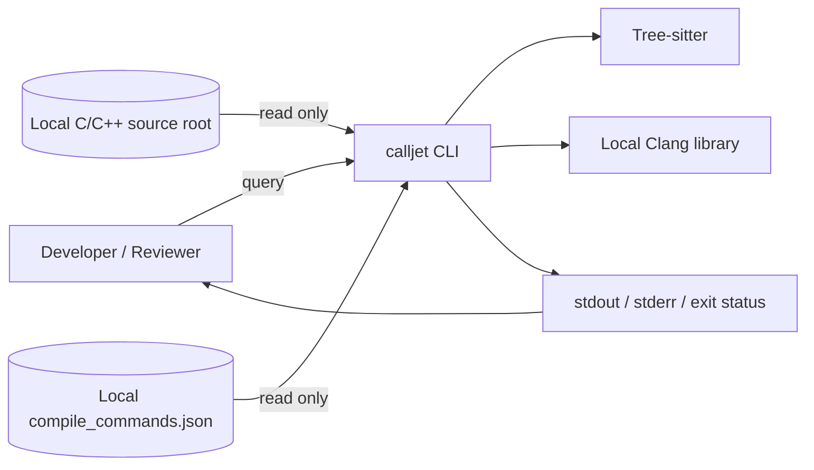
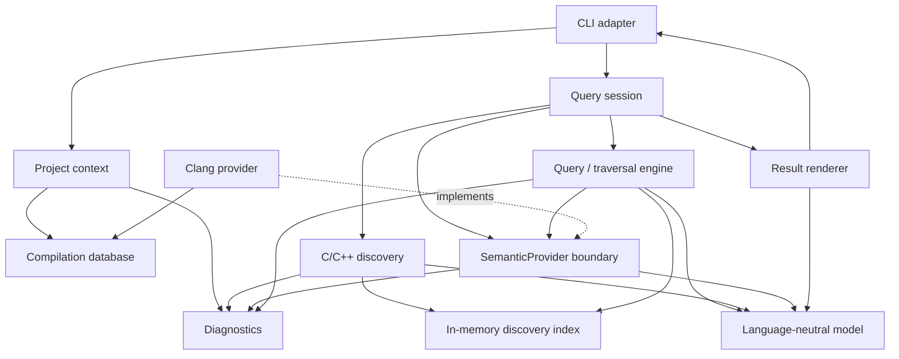
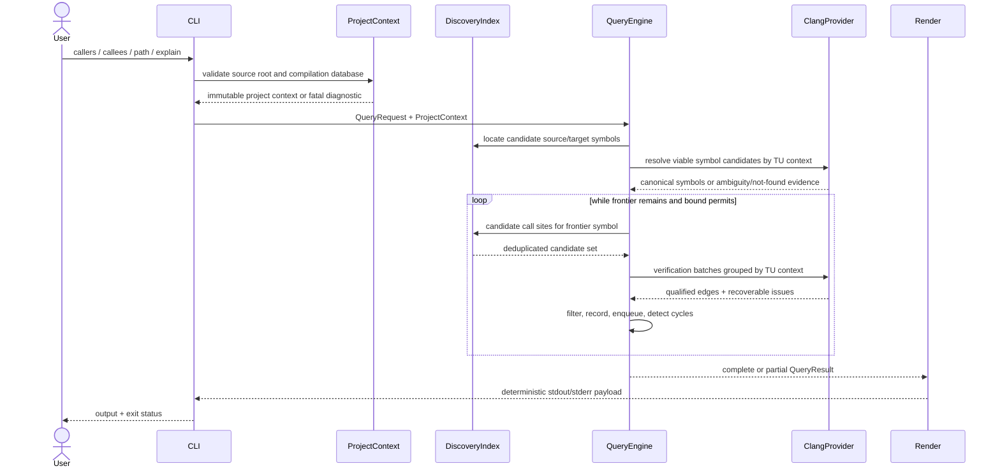
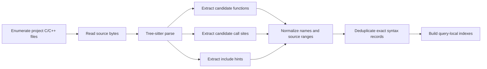
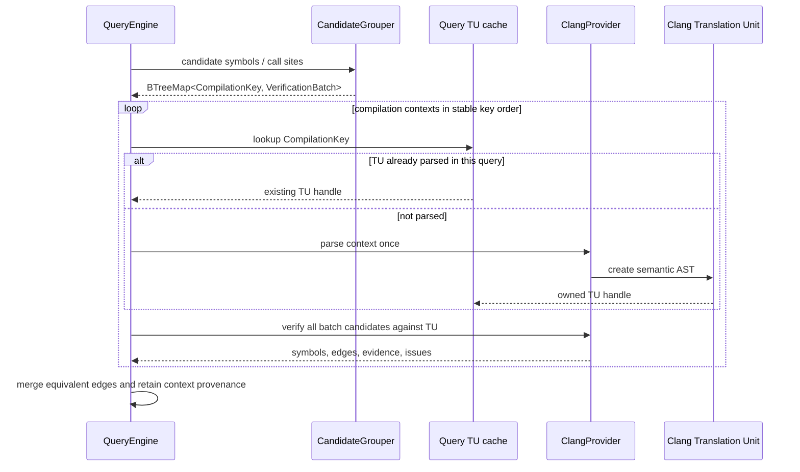
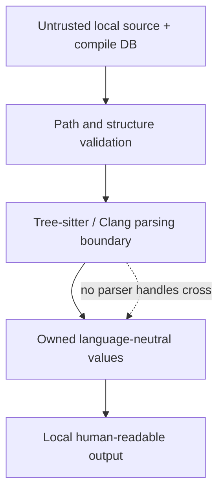

# CallJet C++ — Software Design Specification

| Field | Value |
| --- | --- |
| Status | Initial design baseline |
| Authoritative requirements | [Software Requirements Specification](srs.md) |
| Product scope | [Product Concept](concept.md) |
| Supporting design | [Architecture](architecture.md), [Initial PoC](poc.md) |
| Initial implementation language | Rust, with Clang's C interface at the semantic boundary |

## 1. Purpose and design principle

This SDS defines how the initial CallJet C++ implementation satisfies the SRS.
It refines requirements into components, interfaces, data structures, flows,
invariants, and verification points. It does not add product requirements.
Evidence-dependent targets that remain open are recorded in
[Section 17](#17-remaining-srs-tbds).

The governing design principle is:

> Tree-sitter performs cheap candidate discovery. Clang performs precise
> semantic verification. Expensive semantic work is restricted to the code
> required by the current query.

**SRS trace:** CON-005, CON-006, CON-008, FR-038–FR-045, NFR-001–NFR-002.

## 2. System context and design goals

### 2.1 System context



The process has no remote dependency or network-facing component. Source,
compilation data, intermediate state, diagnostics, and results remain local.
The analyzed program is never executed.

**SRS trace:** CON-001–CON-004, CON-007–CON-008, FR-001–FR-011,
NFR-015–NFR-021.

### 2.2 Design goals

| Goal | Design response | SRS trace |
| --- | --- | --- |
| Query-first analysis | Build only lightweight discovery state broadly; expand and verify semantic edges from the active frontier. | CON-006, FR-044, NFR-001–NFR-002 |
| Correct identity | Keep candidates separate from canonical symbols; only Clang verification creates confirmed identities and edges. | FR-013–FR-018, FR-038–FR-043, NFR-009 |
| Explicit uncertainty | Preserve possible and unresolved evidence; never promote text matches to confirmed edges. | FR-024, FR-029, FR-042, FR-046–FR-047, FR-049–FR-054, NFR-010 |
| Explainable output | Carry source range and semantic evidence with every edge from analysis through rendering. | FR-055–FR-064 |
| Bounded work | Batch by TU, parse a TU context once per query, track visited symbols, and honor maximum depth. | FR-021–FR-023, FR-027–FR-028, FR-034–FR-036, FR-044–FR-045 |
| Deterministic behavior | Use stable sort keys, ordered queues, immutable query inputs, and no externally visible completion-order dependence. | NFR-011–NFR-014 |
| Minimal initial system | One CLI process, in-memory query state, no persistent index, daemon, server, or runtime plugin loader. | FR-075, NFR-008, SRS Section 6 |

## 3. Architecture and dependency direction

### 3.1 Major components and logical boundaries



Arrows point from a consumer to a dependency. The model and diagnostics are
leaf dependencies. Tree-sitter node types stay inside discovery, and Clang
cursor/TU types stay inside the Clang provider. The query engine sees neither.

**SRS trace:** CON-005–CON-008, FR-038–FR-045, FR-046–FR-064,
NFR-001, NFR-009–NFR-010.

### 3.2 Component responsibilities

| Component | Responsibility | Must not own | SRS trace |
| --- | --- | --- | --- |
| CLI adapter | Parse invocation, validate command shape, construct a request, render diagnostics, choose exit status. | Symbol resolution or graph traversal. | FR-001, FR-006, FR-012, FR-030, FR-059, FR-065–FR-074 |
| Project context | Validate source root, load compilation contexts, normalize local paths, expose read-only project metadata. | Candidate or path semantics. | FR-001–FR-011, NFR-020 |
| C/C++ discovery | Parse source syntax and emit candidate symbols, call sites, and include hints. | Canonical identity or confirmed confidence. | CON-005, CON-008, FR-019, FR-025, FR-042 |
| Discovery index | Provide cheap forward and reverse candidate lookup for the active process. | Verified semantic graph or persistent authority. | FR-019–FR-029, NFR-001–NFR-002, NFR-008 |
| Query engine | Resolve command intent, manage frontier, request candidate verification, build result paths, enforce filters and bounds. | Tree-sitter or Clang-specific objects. | FR-019–FR-037, FR-054, FR-072–FR-073 |
| SemanticProvider | Translate candidate batches plus build context into canonical symbols, qualified edges, and evidence. | Traversal or CLI formatting. | FR-013–FR-018, FR-038–FR-053 |
| Clang provider | Implement C/C++ semantic resolution with one parsed TU per unchanged build context per query. | Project-wide eager verification. | CON-004, CON-006, CON-008, FR-038–FR-045 |
| Result renderer | Produce deterministic human-readable paths, locations, confidence, counts, explanations, and diagnostics. | Analysis decisions. | FR-017–FR-018, FR-043, FR-055–FR-075, NFR-011–NFR-012 |
| Diagnostics | Carry typed fatal and recoverable issues without formatting policy. | Process termination. | FR-003–FR-011, FR-015–FR-016, FR-035, FR-057, FR-064, FR-068–FR-071 |

### 3.3 Module boundaries

The logical design maps to the following minimal Rust module layout. Small
modules may initially share files; the dependency rules are more important
than the physical file count.

```text
src/
├── main.rs             CLI entry and exit-status mapping
├── cli.rs              argument parsing and request construction
├── model.rs            language-neutral symbols, edges, locations, results
├── project.rs          source-root validation and project context
├── compile_db.rs       compilation database adapter
├── discovery.rs        C/C++ Tree-sitter extraction and in-memory index
├── semantic/
│   ├── mod.rs          internal SemanticProvider contract
│   └── clang.rs        Clang implementation and FFI ownership
├── query.rs            caller/callee/path traversal and session state
├── render.rs           deterministic human-readable output
└── diagnostic.rs       typed errors and recoverable issues
```

All interfaces are `pub(crate)` except the binary's CLI. The initial release
does not promise a stable Rust library API or machine-readable protocol.

**SRS trace:** CON-002, FR-065–FR-075, NFR-011–NFR-012, SRS Section 6.

### 3.4 Dependency invariants

1. `model` imports no parser, Clang, CLI, filesystem, or renderer types.
2. `query` depends on language-neutral model types, discovery lookup, and the
   internal semantic contract only.
3. `discovery` never constructs `Confidence::Confirmed` or a canonical
   `SymbolId`.
4. `semantic::clang` is the only module that owns Clang handles or interprets
   Clang cursors.
5. `render` consumes completed result values and never changes confidence,
   ordering semantics, or path membership.
6. No component opens a network connection or executes a compilation command.

**SRS trace:** CON-003, CON-005–CON-008, FR-011, FR-042,
NFR-009, NFR-015–NFR-020.

## 4. End-to-end query flow



Discovery is initiated by the query session and may inspect broad C/C++ source
coverage cheaply to support reverse lookup. Semantic verification is never
started for a TU unless a current symbol-resolution or traversal candidate
requires that TU context.

**SRS trace:** FR-012–FR-045, FR-054–FR-074, NFR-001–NFR-002,
NFR-007.

## 5. Project context and compilation database

### 5.1 Source-root processing

`ProjectContext::load` performs these steps before analysis:

1. Convert the supplied root to an absolute normalized local path.
2. Verify that it exists, is a readable directory, and can be enumerated.
3. Record the canonical root for containment checks and a display root for
   stable relative output.
4. Treat files within the root as project-discovery scope.
5. Permit Clang to read headers and dependencies outside the root only when the
   compilation context references them; those files are semantic context, not
   project traversal roots.

Source files and the compilation database are opened read-only. Normalized
relative paths are used for deterministic display when a location lies inside
the source root; external locations remain normalized absolute paths.

**SRS trace:** FR-001–FR-005, FR-055–FR-058, NFR-011–NFR-012,
NFR-018–NFR-020.

### 5.2 compile_commands.json processing

The compilation database adapter uses Clang's compilation-database API to
materialize argument vectors. It does not shell-execute the recorded `command`
string. This avoids platform-specific shell parsing and prevents analysis from
running arbitrary build commands.

```rust
struct ProjectContext {
    source_root: CanonicalPath,
    display_root: PathBuf,
    compilation_db: CompilationDb,
}

struct CompilationDb {
    source_file_to_contexts: BTreeMap<CanonicalPath, Vec<CompilationContext>>,
    diagnostics: Vec<Diagnostic>,
}

struct CompilationContext {
    key: CompilationKey,
    directory: CanonicalPath,
    source_file: CanonicalPath,
    clang_args: Vec<OsString>,
}

struct CompilationKey(String); // query-stable digest of normalized context

struct VerificationBatch {
    context: CompilationKey,
    symbols: Vec<CandidateSymbolId>,
    calls: Vec<CandidateCallId>,
}
```

Processing rules:

1. Validate file existence, readability, JSON syntax, and non-empty usable
   entries before query execution.
2. Resolve relative `directory` and `file` values without changing their
   intended build context.
3. Prefer the database's argument-vector form when available; otherwise use
   the Clang database adapter's parsed command arguments.
4. Remove only driver arguments that request compilation output or dependency
   files; preserve language, standard, target, include, define, and other
   semantic options.
5. Never infer absent include paths, defines, language modes, or target flags.
6. Retain distinct entries for the same source file as distinct build contexts.
7. Index errors by entry so diagnostics identify the affected source and
   reason.
8. Schedule every context applicable to a required candidate and expose its
   key, source file, working directory, and semantic arguments as provenance.

A `CompilationKey` is derived from normalized directory, source file, and
semantic argument vector. It is used only within the query for grouping and
deduplication; it is not a public identifier.

**SRS trace:** CON-004, FR-006–FR-011, FR-038, FR-045, FR-078,
NFR-011, NFR-020.

### 5.3 Header-to-TU association

Headers do not supply standalone build context. Discovery records syntactic
include relationships and associates a header candidate with compilation
contexts whose source files may include it. Clang confirms whether the header
and candidate occur in each selected TU. If no usable including context can be
found, the candidate remains unresolved with a missing-build-context issue; it
is not confirmed using guessed flags.

This include association is a candidate narrowing mechanism, not semantic
proof. It may scan include directives broadly but may not trigger Clang parsing
of a TU with no candidate relationship to the active query.

**SRS trace:** FR-010–FR-011, FR-038, FR-044, NFR-009.

## 6. Tree-sitter discovery design

### 6.1 Pipeline



Discovery recognizes C/C++ extensions represented by the project and parses
source bytes with the matching Tree-sitter grammar. It extracts:

- function and method declarations and definitions;
- lexical namespace and owner hints;
- parameter/signature text when syntactically available;
- enclosing callable for each call expression;
- callee spelling and qualifier hints;
- call expression range and spelling/expansion hints;
- local include directives for header-to-TU candidate mapping.

Syntax errors are recorded per file. Tree-sitter's recoverable parse nodes may
still yield candidates, but any candidate derived through an erroneous region
is marked syntactically incomplete and cannot become confirmed without Clang
evidence.

**SRS trace:** CON-005, CON-008, FR-002, FR-004,
FR-019–FR-029, FR-042, NFR-014.

### 6.2 Discovery index

The PoC uses one in-memory index for the current process:

```rust
struct DiscoveryIndex {
    symbols_by_name: BTreeMap<NameKey, Vec<CandidateSymbolId>>,
    symbols: BTreeMap<CandidateSymbolId, CandidateSymbol>,
    calls_by_spelling: BTreeMap<NameKey, Vec<CandidateCallId>>,
    calls_by_caller: BTreeMap<CandidateSymbolId, Vec<CandidateCallId>>,
    calls: BTreeMap<CandidateCallId, CandidateCallSite>,
    include_parents: BTreeMap<CanonicalPath, BTreeSet<CanonicalPath>>,
}
```

`NameKey` is a conservative normalized lookup key, such as the terminal name
plus available qualifier. It narrows lookup only. It never establishes
identity, overload choice, or confidence.

The reverse index supports callers queries without a semantic whole-project
graph. The forward index supports callees and path expansion from one function
body. Ordered maps and sorted insertion make results independent of filesystem
enumeration order.

**SRS trace:** FR-013–FR-016, FR-019–FR-037,
NFR-001–NFR-002, NFR-011–NFR-012.

### 6.3 Candidate deduplication

Exact discovery duplicates use these query-local keys:

```rust
struct CandidateSymbolKey {
    file: CanonicalPath,
    declaration_range: SourceRange,
    syntactic_kind: CandidateSymbolKind,
}

struct CandidateCallKey {
    file: CanonicalPath,
    expression_range: SourceRange,
    enclosing_symbol: CandidateSymbolId,
    callee_spelling: String,
}
```

Records are deduplicated only when their complete keys match. Same-name
symbols, overloads, separate call sites, macro expansions at different
locations, and distinct build contexts are never collapsed merely to reduce
work.

**SRS trace:** FR-013–FR-018, FR-023, FR-028, FR-042,
NFR-009, NFR-012.

## 7. Clang semantic verification design

### 7.1 Provider boundary

The query engine is generic over one internal semantic contract. Dynamic
plugin loading is not part of the design.

```rust
trait SemanticProvider {
    fn resolve_symbols(
        &mut self,
        project: &ProjectContext,
        candidates: &[CandidateSymbolId],
    ) -> ResolutionBatch;

    fn verify_calls(
        &mut self,
        project: &ProjectContext,
        batch: VerificationBatch,
    ) -> VerificationResult;
}
```

Production instantiates `QueryEngine<ClangProvider>`. Tests may instantiate a
small fake provider. The trait is internal and is not a stable plugin API.

**SRS trace:** CON-008, FR-013–FR-018, FR-038–FR-045,
SRS Section 6.

### 7.2 TU-based verification



Candidates are grouped by `CompilationKey` before parsing. The provider owns a
query-scoped map from key to either a parsed TU or its parse failure. A failure
is cached as well, preventing repeated attempts for separate candidates in the
same unchanged context.

Every applicable compilation context for the same source is analyzed; the
design never silently selects one build configuration. Verification occurs per
context, after which equivalent semantic edges are merged and all contributing
context keys remain attached as provenance.

**SRS trace:** FR-008–FR-011, FR-038–FR-045,
NFR-001–NFR-002, AC-008–AC-009.

### 7.3 Clang pipeline

For each required context, `ClangProvider`:

1. Creates a Clang index and parses the TU with the normalized semantic
   arguments, without running the compiler command.
2. Maps requested physical source ranges to Clang cursors.
3. Resolves each symbol cursor to its canonical declaration.
4. Resolves call-expression references, overload selections, method owners,
   signatures, template information, and compile-time dispatch data exposed by
   Clang.
5. Generates a Clang USR for canonical declarations when available.
6. Classifies call kind and confidence from semantic evidence.
7. Converts Clang-owned data into language-neutral owned values before the TU
   handle leaves provider scope.
8. Records parse diagnostics and per-candidate failures without promoting
   uncertain edges.

The provider uses Clang's C interface directly through Rust FFI. It does not
consume textual AST dumps, because their format is not a stable interface and
would require a second parser. It does not use a C++ sidecar process in the PoC,
avoiding an additional protocol and executable.

**SRS trace:** CON-003–CON-004, CON-008, FR-038–FR-045,
NFR-009–NFR-010, NFR-024–NFR-026.

### 7.4 Verification invariants

1. Only `ClangProvider` may produce canonical backend identities.
2. `CONFIRMED` requires an exact canonical callee reference at the reported
   call site in the active compilation context.
3. A missing cursor, parse failure, ambiguous reference, or textual match alone
   can never produce `CONFIRMED`.
4. A TU build context is parsed at most once per query, including failed parse
   attempts.
5. No TU lacking a current candidate or required build context is parsed.
6. Clang diagnostics are evidence; they do not overwrite unrelated verified
   edges or raise their confidence.
7. All Clang handles are dropped by the provider after their last query-scoped
   use and never enter cached persistent state.

**SRS trace:** FR-038–FR-045, FR-047, NFR-009–NFR-010,
NFR-014.

## 8. Core data model

### 8.1 Locations and candidate identities

Discovery identities exist only within a query session and cannot be used as
semantic identities.

```rust
enum Language {
    C,
    Cpp,
}

struct LineColumn {
    line: u32,   // one-based for display
    column: u32, // one-based for display
}

struct SourceLocation {
    file: CanonicalPath,
    point: Option<LineColumn>,
}

struct SourceRange {
    start: SourceLocation,
    end: Option<SourceLocation>,
}

struct CandidateSymbolId(u32); // query-local arena index

struct CandidateSymbol {
    id: CandidateSymbolId,
    language: Language,
    name: String,
    qualifier_hint: Option<String>,
    signature_hint: Option<String>,
    owner_hint: Option<String>,
    declaration: SourceRange,
    definition_body: Option<SourceRange>,
    syntax_complete: bool,
}

struct CandidateCallId(u32); // query-local arena index

struct CandidateCallSite {
    id: CandidateCallId,
    caller: CandidateSymbolId,
    callee_spelling: String,
    qualifier_hint: Option<String>,
    expression: SourceRange,
    expression_text: Option<String>,
    syntax_hint: CandidateCallKind,
    syntax_complete: bool,
}
```

Locations distinguish missing coordinates from line zero. Source expression
text is optional and bounded to the call expression; CallJet does not retain
whole-file copies solely for explanation after the query finishes.

**SRS trace:** FR-012–FR-018, FR-055–FR-058, FR-061,
NFR-021.

### 8.2 Canonical symbol identity

```rust
struct SymbolId {
    language: Language,
    backend_id: BackendSymbolId,
}

enum BackendSymbolId {
    ClangUsr(String),
    ClangLocationFallback {
        canonical_declaration: SourceLocation,
        cursor_kind: String,
        qualified_name: String,
        signature: Option<String>,
    },
}

struct Symbol {
    id: SymbolId,
    name: String,
    qualified_name: Option<String>,
    signature: Option<String>,
    declaration: Option<SourceLocation>,
    definition: Option<SourceLocation>,
}
```

Clang USR is primary. The location fallback is permitted only when the USR is
absent and all fallback fields identify one canonical declaration within the
active context. If uniqueness cannot be demonstrated, no canonical ID is
invented and the candidate remains possible or unresolved.

The path engine treats `backend_id` as opaque. Display names never participate
in `SymbolId` equality.

**SRS trace:** FR-013–FR-018, FR-038–FR-042,
NFR-009, NFR-011.

### 8.3 Verified edge and evidence

```rust
struct CallEdge {
    id: CallEdgeId,
    caller: SymbolId,
    callee: Option<SymbolId>,
    callsite: SourceRange,
    kind: CallKind,
    confidence: Confidence,
    contexts: BTreeSet<CompilationKey>,
    evidence_by_context: BTreeMap<CompilationKey, VerificationEvidence>,
}

struct VerificationEvidence {
    expression_text: Option<String>,
    static_target: Option<Symbol>,
    candidate_targets: Vec<Symbol>,
    clang_diagnostics: Vec<SemanticDiagnostic>,
    reason: VerificationReason,
    spelling_location: Option<SourceLocation>,
    expansion_location: Option<SourceLocation>,
    is_virtual: bool,
    is_template_related: bool,
    is_macro_expanded: bool,
}

enum VerificationReason {
    ExactReference,
    MultipleRuntimeTargets,
    IndirectTargetUnknown,
    CursorNotFound,
    AmbiguousReference,
    ForeignBoundary,
}
```

`callee` is `None` only when a target identity is unavailable. Possible edges
with known candidate targets are represented as separate edges per target so
traversal can continue without pretending one is definite. Evidence remains
attached to each edge and directly drives `explain` output.

Missing build context and TU parse failure are analysis failures, not
`UNRESOLVED` evidence, and therefore do not construct a `CallEdge` for the
affected candidate.

Different call sites remain separate edges. Equivalent edges from different
compilation contexts merge only when caller, callee, call site, kind, and
confidence match; their context-specific evidence remains separate. For a
macro-expanded call, `callsite` uses the expansion location a
developer can navigate in project source; evidence retains the macro spelling
location as well.

**SRS trace:** FR-037, FR-041, FR-043, FR-046–FR-064,
NFR-009–NFR-014.

### 8.4 Confidence model

```rust
enum Confidence {
    Confirmed,
    Possible,
    Unresolved,
}
```

Construction rules are centralized in the Clang provider:

| State | Construction rule |
| --- | --- |
| `Confirmed` | Clang resolves the exact canonical caller and callee reference at the call site in the active context. |
| `Possible` | One or more identified targets are statically valid, but evidence cannot prove a unique runtime target. |
| `Unresolved` | Semantic analysis completed, but no unique callee identity could be established from available evidence. |

Confidence is not treated as a numeric score. There is no averaging or
automatic promotion when duplicate evidence is merged. `PROBABLE` has no enum
variant, parser value, renderer branch, or constructor in the initial product.

**SRS trace:** FR-046–FR-047, FR-049–FR-054, FR-076, FR-079,
NFR-009–NFR-010.

### 8.5 Call kind model

```rust
enum CallKind {
    Direct,
    Virtual,
    FunctionPointer,
    Template,
    MacroExpanded,
    Foreign,
    Unresolved,
}
```

One primary kind is stored for compatibility with the SRS model. When a call
has overlapping traits, semantic dispatch takes precedence over syntactic
origin in this order:

1. `Unresolved` when no semantic call form can be established;
2. `Foreign` at a language or project boundary;
3. `FunctionPointer` for indirect pointer invocation;
4. `Virtual` for virtual dispatch not suppressed by qualified invocation;
5. `MacroExpanded` when expansion materially defines the call site;
6. `Template` when template instantiation materially defines the target;
7. `Direct` otherwise.

The evidence flags preserve overlapping macro, template, and virtual facts for
explanation. Kind and confidence are computed independently: for example,
`Virtual/Possible` and `Virtual/Confirmed` are both valid combinations.

**SRS trace:** FR-037, FR-052–FR-053, FR-060,
SRS RES-005.

### 8.6 Result model

```rust
enum QueryRequest {
    Callers { target: SymbolQuery, max_depth: Option<usize>, verified_only: bool },
    Callees { source: SymbolQuery, max_depth: Option<usize>, verified_only: bool },
    Path { source: SymbolQuery, target: SymbolQuery, max_depth: Option<usize>, verified_only: bool },
    Explain { caller: SymbolQuery, callee: SymbolQuery },
}

struct QueryResult {
    completion: Completion,
    symbols: BTreeMap<SymbolId, Symbol>,
    edges: Vec<CallEdge>,
    paths: Vec<CallPath>,
    counts: ResultCounts,
    diagnostics: Vec<Diagnostic>,
    metrics: QueryMetrics,
}

enum Completion {
    Complete,
    NoResult,
    Truncated { max_depth: usize },
    Partial,
}

struct CallPath {
    nodes: Vec<SymbolId>,
    edges: Vec<CallEdgeId>,
}

struct QueryMetrics {
    source_files_inspected: usize,
    candidate_call_sites: usize,
    available_translation_units: usize,
    verified_translation_units: usize,
    discovery_time: Duration,
    verification_time: Duration,
    total_query_time: Duration,
    peak_resident_memory_bytes: u64,
}
```

The structured result is internal. Human-readable rendering is the only public
output contract. `CallPath` maintains `nodes.len() == edges.len() + 1`.

**SRS trace:** FR-019–FR-037, FR-065–FR-075,
NFR-003, NFR-011–NFR-012.

## 9. Demand-driven query and traversal design

### 9.1 Shared traversal state

Caller, callee, and path operations share a breadth-first traversal primitive:

```rust
struct FrontierItem {
    symbol: SymbolId,
    depth: usize,
    predecessor: Option<(SymbolId, CallEdgeId)>,
}

struct TraversalState {
    frontier: VecDeque<FrontierItem>,
    best_depth: HashMap<SymbolId, usize>,
    predecessors: HashMap<SymbolId, (SymbolId, CallEdgeId)>,
    edges: BTreeMap<VerifiedEdgeKey, CallEdge>,
}
```

Breadth-first traversal produces a path with the fewest reported edges without
requiring ranking infrastructure. The SRS does not promise shortest paths, so
this remains an internal deterministic choice.

For stable behavior, candidates and verified edges are sorted before enqueue
by qualified name, signature, source path, line, column, backend identity, and
compilation key. Work completion order never determines output order.

**SRS trace:** FR-020–FR-023, FR-026–FR-028, FR-031–FR-036,
NFR-011–NFR-012, SRS RES-007.

### 9.2 Caller traversal

For `callers(target)`:

1. Discovery locates symbol candidates matching the target query.
2. Clang resolves them; zero or multiple viable selections produce the SRS
   not-found or ambiguity outcome.
3. The selected canonical target enters the reverse frontier at depth zero.
4. `calls_by_spelling` yields syntactic call sites that may name the frontier
   symbol; scope hints narrow but never prove the match.
5. Candidate sites are deduplicated and grouped by compilation context.
6. Clang verifies each group.
7. Edges whose callee equals the frontier symbol, or whose possible target set
   contains it, are recorded. Their callers enter the next frontier unless
   already expanded at an equal or shallower depth.
8. Unresolved matching call sites are reported under the current target but
   are expanded only when their caller has a canonical identity.

**SRS trace:** FR-012–FR-024, FR-038–FR-054.

### 9.3 Callee traversal

For `callees(source)`:

1. Resolve the source to one canonical symbol.
2. Locate its candidate definition body.
3. Read `calls_by_caller` for call sites within that body.
4. Group and verify those sites by TU context.
5. Record every qualified edge. Enqueue each known callee identity that passes
   the verified-only filter and has not been expanded at a shallower depth.
6. Retain unresolved edges in results but do not enqueue them because they have
   no target identity.

**SRS trace:** FR-012–FR-018, FR-025–FR-029,
FR-038–FR-054.

### 9.4 Path traversal

For `path(source, target)`:

1. Resolve both endpoint queries before traversal.
2. Run the forward callee traversal from the source.
3. Stop after dequeuing the target; reconstruct the path through predecessor
   links.
4. If the frontier empties first, return `NoResult`.
5. If a depth bound prevents at least one further expansion, return
   `Truncated { max_depth }`, not `NoResult`.
6. Possible edges with a known callee may participate in the default path;
   their confidence remains visible. Unresolved edges cannot be traversed.
7. With verified-only enabled, filter non-confirmed edges before enqueue, not
   merely during rendering.

**SRS trace:** FR-030–FR-037, FR-046–FR-047, FR-049–FR-054,
FR-072–FR-074, SRS RES-006.

### 9.5 Cycle detection and depth semantics

Depth counts call edges from the query's initial symbol. An item at depth
equal to `max_depth` may be returned but is not expanded. `best_depth` prevents
re-expansion at an equal or greater depth; a newly discovered shallower route
may replace predecessor state before that node is expanded.

The edge collection is independent from the visited-symbol set. This preserves
multiple call sites and alternate incoming edges while preventing cycles from
growing the frontier indefinitely.

If source equals target, a path query returns the zero-edge path immediately.
When `max_depth` is `None`, no numeric depth check is applied; the finite
frontier and `best_depth` cycle detection remain active.

**SRS trace:** FR-021–FR-023, FR-027–FR-028, FR-034–FR-036,
FR-077, NFR-002, NFR-023.

### 9.6 Verified-edge deduplication

```rust
struct VerifiedEdgeKey {
    caller: SymbolId,
    callee: Option<SymbolId>,
    callsite: SourceRange,
    kind: CallKind,
    confidence: Confidence,
}
```

Only identical semantic keys merge. Each merge inserts the contributing
`CompilationKey` and its evidence into the edge's ordered provenance maps.
Different callees, call sites, kinds, or confidence states remain distinct
edge variants. Conflicting classifications for the same candidate and context
are an internal invariant failure and never promote confidence.

**SRS trace:** FR-013, FR-023, FR-028, FR-042, FR-078,
NFR-009, NFR-012, NFR-014.

### 9.7 Explain query

For `explain(caller, callee)`:

1. Resolve caller and callee queries to canonical identities or return the
   normal ambiguity/not-found outcome.
2. Read candidate call sites inside the caller whose spelling may match the
   callee.
3. Group and verify those candidates using the same TU pipeline as traversal.
4. Select verified or qualified edges matching both requested identities.
5. Return every distinct matching call site. If the request cannot distinguish
   among viable symbol pairs, return their choices instead of selecting one.
6. Render call site, expression or range, kind, confidence, semantic target,
   and verification or unresolved reason directly from edge evidence.

Explain performs no separate inference and cannot strengthen an edge's
confidence. A missing matching edge produces the no-edge outcome.

**SRS trace:** FR-015–FR-018, FR-041, FR-043,
FR-055–FR-064.

## 10. Query-scoped caching and resource ownership

The initial cache is deliberately process-local and query-scoped:

| Cached item | Key | Lifetime | Purpose |
| --- | --- | --- | --- |
| Source bytes and Tree-sitter tree | Canonical source path | Query session | Avoid rereading/reparsing during forward and reverse lookup. |
| Discovery index | Project context | Query session | Reuse candidate lookup across frontier steps. |
| Parsed Clang TU or parse failure | `CompilationKey` | Query session | Enforce one parse attempt per TU context. |
| Canonical symbol resolution | Candidate plus `CompilationKey` | Query session | Avoid repeated cursor-to-symbol conversion. |
| Verified edge result | Candidate call plus `CompilationKey` | Query session | Avoid repeated semantic verification. |

No persistent cache or database is created in the PoC. Process exit releases
all cached source-derived state. Every new CLI invocation rereads source and
build context, which makes stale-result detection trivial for the initial
one-query process model. If a future multi-query process is introduced, it
must compare current source and compilation-database bytes before reuse; that
change requires design and test updates but not a persistent database.

Cache capacity is bounded by the current source-discovery set plus TUs reached
by the query. Metrics record files, candidates, available and verified TUs,
phase times, and peak resident memory. No unsupported fixed memory or latency
target is introduced.

**SRS trace:** FR-044–FR-045, NFR-003–NFR-008,
NFR-013, NFR-019–NFR-021, SRS Section 6.

## 11. Error propagation and partial results

### 11.1 Typed diagnostic model

```rust
enum Diagnostic {
    Input(InputError),
    Query(QueryError),
    Analysis(AnalysisIssue),
    Internal(InternalError),
}

enum Severity {
    Fatal,
    Recoverable,
}

struct AnalysisIssue {
    severity: Severity,
    context: Option<CompilationKey>,
    location: Option<SourceLocation>,
    message: String,
    cause: AnalysisCause,
}
```

Errors use typed causes internally. Human-readable text is added only by the
renderer so wording cannot affect control flow.

**SRS trace:** FR-003–FR-011, FR-015–FR-016, FR-035,
FR-057, FR-064, FR-068–FR-071.

### 11.2 Failure modes and propagation rules

| Failure | Handling | Result / status | SRS trace |
| --- | --- | --- | --- |
| Invalid CLI shape or option | Stop before project loading. | Diagnostic, non-zero. | FR-068–FR-069 |
| Invalid source root or compilation database | Stop before discovery. | Diagnostic naming input, non-zero. | FR-003, FR-006–FR-010, FR-069 |
| Symbol not found | Stop that query without traversal. | Distinct no-symbol diagnostic, non-zero. | FR-016, FR-069, FR-071 |
| Ambiguous required symbol | Return all viable choices; do not select. | Ambiguity diagnostic, non-zero. | FR-015, FR-069, FR-071 |
| Candidate lacks required build context | Record failed work without constructing an unresolved edge; continue independent batches. | Partial result with usable results and non-zero status, or analysis failure when none are usable. | FR-010–FR-011, FR-069, FR-080–FR-081 |
| One required TU fails to parse | Cache failure, record affected work as unavailable, and continue independent TUs. | Partial result with usable results and non-zero status. | FR-004, FR-043, FR-069, FR-080–FR-081, NFR-014 |
| Semantic analysis completes but no unique callee resolves | Emit possible targets when known or one unresolved edge when none is identifiable. | Successful query with zero status if no separate analysis work failed. | FR-046–FR-047, FR-049–FR-053, FR-070–FR-071, FR-079 |
| Clang terminates the process through an unrecoverable native fault | No partial result can be trusted or rendered after termination. | Operating-system non-zero termination; no persisted semantic state. | FR-069, NFR-008–NFR-009 |
| User-supplied depth limit reached | Stop deeper expansion and retain bounded results. | `Truncated { max_depth }`, zero status, distinct truncation metadata. | FR-021, FR-027, FR-034–FR-035, FR-070–FR-071, FR-081 |
| Complete search finds no result | Return empty completed result. | `NoResult`, zero status. | FR-033, FR-070–FR-071 |
| Internal invariant violation | Stop affected analysis; never raise confidence. | Partial evidence if safe, internal diagnostic, non-zero. | FR-069, NFR-009, NFR-014 |
| Output pipe closes | Stop rendering and release local state. | Non-zero I/O failure; no analysis mutation. | FR-069, NFR-020 |

Partial output begins with an explicit incomplete-analysis diagnostic and lists
the work that failed. It does not manufacture `UNRESOLVED` edges for work that
could not be analyzed. Confirmed independent edges may still be displayed
because their evidence remains valid. The renderer never labels a partial
search as proof that no path exists.

**SRS trace:** FR-004, FR-009–FR-011, FR-033, FR-035,
FR-043, FR-046–FR-051, FR-069–FR-071, FR-079–FR-081,
NFR-014.

## 12. Public and internal interfaces

### 12.1 Public boundary

The only supported public boundary is the `calljet` process:

```text
stdin / argv / local files
          ↓
       calljet
          ↓
stdout + stderr + zero/non-zero exit status
```

The command surface contains callers, callees, path, and explain operations,
plus source-root, compilation-database, depth, verified-only, and help inputs
required by the SRS. Exact flag spelling not already fixed by the SRS remains
CLI adapter policy. No JSON, daemon protocol, Rust crate API, C ABI, or plugin
ABI is public in the initial release.

**SRS trace:** CON-002, FR-001, FR-006, FR-012, FR-030,
FR-059, FR-065–FR-075.

### 12.2 Internal contracts

```rust
impl ProjectContext {
    fn load(input: ProjectInput) -> Result<Self, InputError>;
}

impl DiscoveryIndex {
    fn matching_symbols(&self, query: &SymbolQuery) -> &[CandidateSymbolId];
    fn candidate_callers(&self, target: &Symbol) -> Vec<CandidateCallId>;
    fn candidate_callees(&self, source: CandidateSymbolId) -> &[CandidateCallId];
    fn contexts_for(&self, call: CandidateCallId) -> Vec<CompilationKey>;
}

impl<S: SemanticProvider> QueryEngine<S> {
    fn execute(&mut self, request: QueryRequest) -> Result<QueryResult, FatalError>;
}

impl HumanRenderer {
    fn render(&self, result: &QueryResult) -> RenderedOutput;
}
```

Slices and returned values contain owned language-neutral identifiers, never
borrowed Tree-sitter nodes or Clang cursors. The query session owns project,
discovery, provider, caches, metrics, and diagnostic collection, which makes
lifetime and cleanup boundaries explicit.

**SRS trace:** CON-005, FR-019–FR-045, FR-055–FR-075,
NFR-008–NFR-014.

### 12.3 Future language-backend seam

The initial executable constructs only the concrete C/C++ discovery path and
`ClangProvider`. The language-neutral `SymbolId`, `CallEdge`, `QueryResult`, and
query engine do not inspect Clang IDs, so a future language can supply candidate
records and implement the internal semantic contract without changing
traversal.

No backend registry, dynamic loading, configuration format, cross-language
edge, or non-C/C++ implementation is created now. If a second language is
approved later, the discovery output contract can be extracted into a trait at
that time; creating a one-implementation discovery abstraction now adds no
value.

**SRS trace:** FR-014, SRS Section 6, SRS future-language non-goal.

## 13. Concurrency and determinism

The PoC processes one query per CLI process and uses one orchestration thread.
Source discovery, TU groups, and result merges run in stable sorted order.
Clang may use internal implementation threads, but CallJet does not depend on
their completion order and does not share a mutable TU across CallJet workers.

This intentionally avoids a scheduler, locks, duplicate parse races, and
memory spikes before a performance baseline exists. It also makes the
one-parse-per-context invariant directly testable.

If measurements later show semantic verification is the limiting phase, a
bounded worker pool may process independent `CompilationKey` batches. That
change must preserve:

- one owner per TU handle;
- one parse attempt per key per query;
- a configured concurrency bound derived from measured memory use;
- deterministic merge by stable edge key rather than completion order;
- cancellation only between candidate batches, never while mutating shared
  result state.

No concurrency extension is implemented by the PoC.

**SRS trace:** FR-045, NFR-003–NFR-007, NFR-011–NFR-012,
NFR-022–NFR-023.

## 14. Local/offline security architecture

### 14.1 Trust boundaries

The source root and compilation database are untrusted local input. They may
contain malformed syntax, invalid paths, hostile argument strings, symlinks,
or references outside the project root. Clang is a local parsing dependency,
not a trusted source of product truth. Diagnostics and recoverable API failures
become analysis issues, never confirmed edges. Because Clang is in-process in
the PoC, an unrecoverable native crash terminates CallJet; process isolation is
an alternative only if crash data later justifies its cost.



**SRS trace:** FR-003–FR-011, NFR-009, NFR-014–NFR-021.

### 14.2 Security controls

1. Open source and compilation data read-only; never rewrite either input.
2. Canonicalize paths for identity and containment; do not discover through a
   symlink whose canonical target lies outside the source root.
3. Allow Clang to read external includes referenced by valid local build
   context, but classify them outside project traversal scope.
4. Parse compilation commands as argument data and never invoke a shell or
   execute the recorded compiler command.
5. Do not load remote URLs, fetch dependencies, emit telemetry, or initialize
   network clients.
6. Keep query caches in process memory. If future diagnostics are written to a
   file, require an explicit local path and document the artifact as sensitive.
7. Bound retained expression text to the call-site range and include it only
   where explainability requires it.
8. Drop all Clang and Tree-sitter resources on success or failure through Rust
   ownership guards.
9. Treat parser crashes, invalid UTF-8, and path-conversion failures as typed
   diagnostics rather than unchecked assumptions.

The product cannot prevent users from redirecting local stdout themselves;
that is outside the CallJet process boundary. CallJet itself initiates no
external transfer.

**SRS trace:** CON-003, CON-007, FR-005, FR-061,
NFR-015–NFR-021.

## 15. Test architecture

### 15.1 Test layers

| Layer | Scope | Representative checks | SRS trace |
| --- | --- | --- | --- |
| Model unit tests | Pure Rust model and keys | Symbol equality, location absence, edge deduplication, confidence constructor rules. | FR-013–FR-018, FR-046–FR-057, NFR-009 |
| Discovery unit tests | Tree-sitter extraction | C/C++ functions, methods, namespaces, calls, templates, macros, syntax errors, stable ordering. | CON-008, FR-002, FR-019, FR-025, FR-042, NFR-012 |
| Compilation DB tests | Local database adapter | Valid/invalid JSON, arguments versus command, relative paths, missing files, all-context analysis and provenance merge, no shell execution. | FR-006–FR-011, FR-078, NFR-020 |
| Traversal unit tests | Query engine with fake semantic provider | Caller/callee/path direction, ambiguity, cycles, unlimited omitted depth, explicit truncation, no result, verified-only, deterministic order. | FR-012–FR-037, FR-054, FR-072–FR-073, FR-077, NFR-011–NFR-012 |
| Clang integration tests | Real local Clang over fixtures | USR identity, overloads, owner types, templates, virtual calls, function pointers, macros, foreign and unresolved calls. | FR-038–FR-053, NFR-009–NFR-010 |
| CLI end-to-end tests | Built `calljet` process | Help, diagnostics, paths, locations, counts, repeatability, and complete/unresolved/truncated/partial statuses. | FR-055–FR-081, NFR-011–NFR-014 |
| Security tests | Network-denied and read-only run | No outbound connections, no source mutation, no command execution, local-only state. | FR-005, NFR-015–NFR-021, AC-010 |
| Benchmark/scale tests | Versioned representative corpus | Required counters, cold/warm times, RSS, TU subset, increasing project scale. | NFR-003–NFR-007, NFR-022–NFR-026 |

### 15.2 Acceptance fixture

One small fixture tree contains:

- a C free-function chain;
- a C++ method call through a pointer or reference;
- same-name functions across namespaces and overload signatures;
- a virtual call with multiple possible runtime targets;
- a function-pointer call with an unresolved target;
- a template-originated call;
- a macro-expanded call;
- a declaration outside project scope to exercise foreign classification;
- a caller cycle; and
- at least two source TUs, with multiple candidates in one TU and one unrelated
  TU that must not be semantically parsed for the focused query; and
- one source with `FEATURE_A` and `FEATURE_B` compilation contexts that select
  different calls.

The test harness creates a temporary local source tree and materializes its
`compile_commands.json` with paths for that tree. It invokes the built CLI and
asserts structured facts from human-readable output without treating incidental
spacing or tree glyphs as semantic behavior.

**SRS trace:** AC-001–AC-015, FR-013, FR-045,
NFR-009–NFR-012.

### 15.3 Determinism, failure, and performance checks

- Run identical queries repeatedly and compare normalized semantic output.
- Feed source files and fake-provider edges in permuted order and require the
  same rendered order.
- Instrument Clang parse attempts and assert at most one per `CompilationKey`.
- Force one TU parse failure and assert unrelated confirmed edges remain valid,
  affected work is reported unavailable rather than unresolved, output is
  partial, and exit is non-zero.
- Run cyclic fixtures under a timeout with omitted depth and several explicit
  bounds; assert explicit truncation exits zero.
- Run an unresolved indirect-call query with no failed work and assert exit
  zero.
- Analyze both feature contexts, merge equivalent edges, and assert provenance
  on every context-dependent edge.
- Hash all source and compilation-database files before and after analysis.
- Run the acceptance suite with outbound networking denied and monitored.
- Record every NFR-003 counter without asserting invented latency, memory, or
  maximum-scale thresholds.

**SRS trace:** FR-004, FR-023, FR-028, FR-035–FR-036,
FR-045, FR-069–FR-071, NFR-003–NFR-006, NFR-009–NFR-020.

## 16. Design decisions and alternatives

| ID | Decision | Rationale | Alternatives considered | SRS trace |
| --- | --- | --- | --- | --- |
| DD-001 | Use a single process with query-scoped in-memory state. | Simplest stale-safe cache; no sensitive persistent index; sufficient for PoC. | Persistent DB or daemon: deferred until measured reuse benefit exists. | NFR-008, NFR-013, NFR-019–NFR-021, SRS Section 6 |
| DD-002 | Use Tree-sitter records only as candidates. | Fast reverse/forward narrowing without false semantic proof. | Tree-sitter-only edges: rejected by correctness and confidence requirements. | CON-005, CON-008, FR-042, NFR-009 |
| DD-003 | Use Clang's C interfaces in-process. | Provides canonical cursors and USRs without parsing unstable textual output or adding a sidecar protocol. | AST JSON subprocess: unstable/large; C++ helper: extra executable/protocol; one Clang process per edge: excessive repeated work. | CON-008, FR-038–FR-045 |
| DD-004 | Analyze every applicable normalized compilation context, parse each once, then merge equivalent edges with provenance. | Preserves configuration-dependent semantics without duplicating equivalent output. | Select one context: loses valid edges; group by source path alone: conflates configurations; parse per candidate: violates FR-045. | FR-008, FR-044–FR-045, FR-078 |
| DD-005 | Keep candidate IDs and canonical symbol IDs as different types. | Makes accidental promotion of a textual match a type-level error. | One nullable ID type: permits unverified/verified confusion. | FR-013–FR-018, FR-038–FR-042 |
| DD-006 | Use breadth-first, stable traversal. | Standard-library queue, natural bounded search, deterministic short-edge result. | DFS: equally correct but less natural for a short first path; ranked search: no ranking requirement. | FR-020–FR-037, NFR-011–NFR-012 |
| DD-007 | Keep unresolved evidence by default and filter before traversal for verified-only. | Preserves product honesty and prevents filtered edges from affecting paths. | Render-only filtering: could produce a path whose hidden edge is non-confirmed. | FR-024, FR-029, FR-037, FR-046–FR-047, FR-049–FR-054 |
| DD-008 | Start with sequential CallJet orchestration. | Deterministic, easiest TU ownership, lowest surprise before performance measurements. | Unbounded parallelism: memory risk; bounded pool: add only when NFR measurements justify it. | FR-045, NFR-003–NFR-007, NFR-011–NFR-012 |
| DD-009 | Never shell-execute compilation database commands. | Analysis needs semantic arguments, not compilation side effects; avoids arbitrary command execution. | Spawn compiler command: violates static/read-only boundary and creates outputs. | CON-003–CON-004, FR-008, NFR-020 |
| DD-010 | Keep one internal `SemanticProvider` extension seam, not a plugin framework. | Separates the path model from Clang and supports isolated query tests while honoring future compatibility. | Hard-code Clang types into query: blocks model independence; runtime plugin registry: initial non-goal. | FR-014, CON-008, SRS Section 6 |

## 17. Remaining SRS TBDs

The product-semantics gaps found during design are resolved by FR-076–FR-081.
No unresolved behavioral SRS gap remains for the PoC design.

Only evidence-dependent non-functional targets remain TBD:

- end-to-end latency;
- peak memory and local source-derived storage;
- maximum validated project size; and
- supported host operating systems, architectures, and Clang ranges.

The benchmark and conformance procedures in SRS NFR-003–NFR-006 and
NFR-024–NFR-026 determine those values. This SDS supplies no arbitrary target.

## 18. Requirements traceability matrix

| SRS requirement | SDS component / section | Verification approach |
| --- | --- | --- |
| CON-001–CON-004 | §2 context, §5 project/compilation DB, §14 security | C/C++ fixture; local CLI; read-only hashes; confirm analyzed program and build command are not executed. |
| CON-005–CON-006 | §3 boundaries, §4 flow, §6 discovery, §7 verification | Assert discovery cannot create confirmed IDs; instrument candidate and verified TU sets. |
| CON-007–CON-008 | §2 context, §6 Tree-sitter, §7 Clang, §14 security | Dependency inspection plus network-denied Tree-sitter/Clang integration run. |
| FR-001–FR-005 | §5.1 source root, §14 security | Valid/invalid root tests, unreadable-file test, network/file activity monitoring. |
| FR-006–FR-011, FR-078 | §5.2 compilation DB, §7.2 TU grouping, §9.6 provenance merge, §11 failures | Missing, malformed, empty, unusable-entry, semantic-flag, and two-context conditional-compilation fixtures. |
| FR-012–FR-018 | §8.1–§8.2 identities, §9 endpoint resolution | Free function, method, namespace, owner, overload, ambiguous, and absent-symbol fixtures. |
| FR-019–FR-024, FR-077 | §6 index, §9.2 caller traversal, §9.5 unbounded depth | Direct/method reverse chains, unbounded recursion, explicit depth, cycle, unresolved, and verified-only tests. |
| FR-025–FR-029, FR-077 | §6 index, §9.3 callee traversal, §9.5 unbounded depth | Forward chains, unbounded recursion, explicit depth, cycle, unresolved, and verified-only tests. |
| FR-030–FR-037, FR-077 | §8.6 result model, §9.4–§9.5 path traversal | Connected, disconnected, zero-edge, mixed-confidence, truncated, unbounded, and cyclic path tests. |
| FR-038–FR-045 | §5 compilation contexts, §7 Clang pipeline, §9.6 deduplication | Instrument real Clang symbol/call resolution, unrelated TU exclusion, and one parse per context. |
| FR-046–FR-047, FR-049–FR-054, FR-076, FR-079 | §8.3–§8.5 edge/confidence/kind, §9 filtering, §11 outcomes | Classification fixtures for all three states and every kind; verify no probable representation; assert unresolved-only exit zero. |
| FR-055–FR-058 | §8.1 locations, §8.3 edge evidence, §12 renderer boundary | Compare call-site and symbol file/line with fixture; test unavailable location. |
| FR-059–FR-064 | §8.3 evidence, §12 interfaces | Explain direct, multiple-site, possible, unresolved, and missing edges. |
| FR-065–FR-075, FR-080–FR-081 | §8.6 results, §11 errors, §12 public boundary | CLI help, invocation, complete/unresolved/truncated/partial statuses, counts, diagnostics, and usable partial output tests. |
| NFR-001–NFR-008 | §4 flow, §7.2 TU grouping, §10 cache, §13 concurrency | Work counters, TU subset, stop conditions, cache deletion, timing/RSS/storage benchmark records. |
| NFR-009–NFR-014 | §7.4 invariants, §8 model, §9 stable traversal, §11 partial results | Adversarial identity tests, repeat runs, permuted input order, source/context change, injected parse failure. |
| NFR-015–NFR-021 | §5 read-only input, §10 memory cache, §14 security | Network-denied monitored run, dependency inspection, source hashes, artifact inspection. |
| NFR-022–NFR-023 | §9 bounded traversal, §13 concurrency | Multi-TU scale fixture, unrelated-TU assertion, deep/cyclic timeout tests. |
| NFR-024–NFR-026 | §7 Clang boundary, §13 portability constraints, §15 tests | Publish only host/toolchain combinations passing the conformance suite; retain TBD otherwise. |
| AC-001–AC-007 | §15.2 fixture, §15.3 checks | Automated local end-to-end caller/path acceptance run with identity, uncertainty, depth, and cycle assertions. |
| AC-008–AC-009 | §7.2 TU verification, §10 metrics | Parse-attempt instrumentation and available-versus-verified TU counters. |
| AC-010–AC-012 | §11 status, §14 security, §15.3 checks | Network-denied immutable-source run and repeated normalized output comparison. |
| AC-013–AC-015 | §15.2 fixture, §15.3 benchmark | Fixture coverage inspection, automated path/count assertion, complete NFR-003 metric record. |
| AC-016–AC-018 | §7.2 all-context verification, §9.5 depth semantics, §11 outcome rules, §15 tests | Unbounded cyclic query, two-context provenance fixture, and unresolved/truncated/partial exit-status checks. |

## 19. Design completion invariants

The implementation is conformant to this SDS only while all of these remain
true:

1. Candidate discovery alone never creates a confirmed call edge.
2. Every confirmed edge has exact Clang evidence, one call site, canonical
   caller/callee identities, and evidence for every contributing context.
3. Every reported edge retains kind, confidence, location, context provenance, and
   explanation evidence.
4. One TU context is parsed no more than once in a query, and unrelated TUs are
   not semantically parsed.
5. Traversal terminates on finite input, applies no numeric limit when depth is
   omitted, honors an explicit depth as successful truncation, and cannot loop
   on a cycle.
6. Verified-only filtering occurs before an edge influences traversal.
7. Stable inputs produce stable semantic ordering and output.
8. Source and compilation data remain read-only and local; recorded build
   commands are never executed.
9. Query-scoped caches are disposable and never authoritative.
10. Future language work can replace discovery and semantic adapters without
    exposing backend identifiers to traversal, but no future backend or plugin
    system exists in the initial product.
11. `UNRESOLVED` is created only after successful semantic analysis; failed
    required work produces partial or failed analysis instead.
12. Every applicable compilation context is analyzed, equivalent edges merge
    with provenance, and `PROBABLE` has no initial representation.

**SRS trace:** CON-003–CON-008, FR-023, FR-028, FR-036,
FR-038–FR-047, FR-049–FR-058, FR-076–FR-081,
NFR-001–NFR-002, NFR-008–NFR-023.
